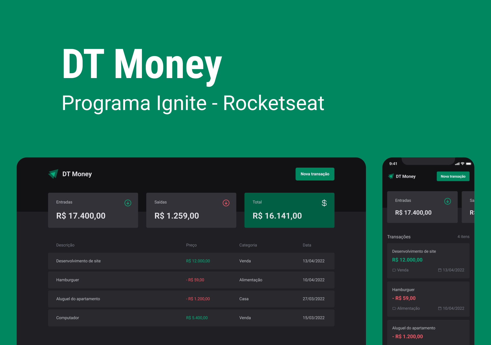
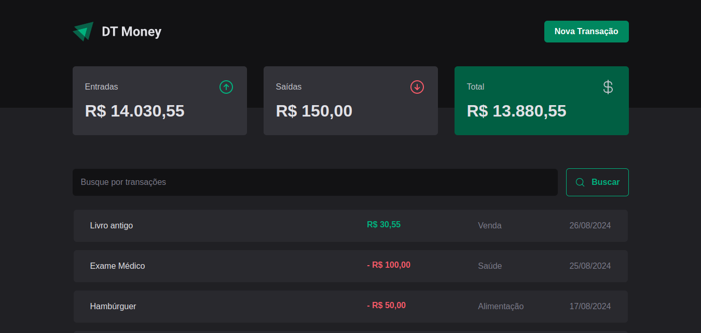
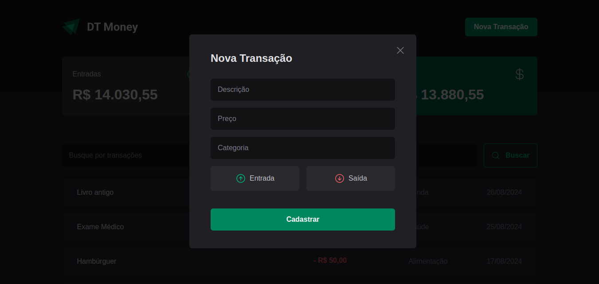

<!-- CABEÇALHO -->

    <h1>
        🤑 DT Money 🤑
    </h1>
    

        <a href="#%EF%B8%8F-sobre-o-projeto">Sobre o Projeto</a> •
        <a href="#-funcionalidades">Funcionalidades</a> •
        <a href="#-layout">Layout</a> •
        <a href="#%EF%B8%8F-tecnologias">Tecnologias</a> •
        <a href="#-autor">Autor</a>
    

<!-- SOBRE O PROJETO -->

## 🖥️ Sobre o Projeto

        

 

> Projeto desenvolvido durante módulo **HTTP e Performance** da Formação de React.js da [Rocketseat](https://www.rocketseat.com.br/).

Esse projeto consiste em uma aplicação de um sistema de controle financeiro.

O objetivo deste desafio consistia em criar uma aplicação front-end completa fazendo conexão com o backend por meio de uma API.

<!-- FUNCIONALIDADES -->

## 💡 Funcionalidades

- [x] Listar transações
- [x] Buscar transações
- [x] Exibir resumo de informações com valores de entrada, saída e total
- [x] Cadastrar nova transação

<!-- LAYOUT -->

## 🎨 Layout

> A aplicação tem como base o seguinte layout no [Figma](https://www.figma.com/community/file/1138814493269096792/dt-money)

  
  

<!-- TECNOLOGIAS -->

## 🛠️ Tecnologias

Para o desenvolvimento desse projeto, as seguintes ferramentas foram utilizadas:

- **[Vite](https://vitejs.dev/)**
- **[React.js](https://pt-br.reactjs.org/)**
- **[TypeScript](https://www.typescriptlang.org/)**
- **[Styled Components](https://www.styled-components.com/)**
- **[React Hook Form](https://react-hook-form.com/)**
- **[Zod](https://zod.dev/)**
- **[JSON Server](https://github.com/typicode/json-server)**
- **[Axios](https://axios-http.com/)**
- **[Radix UI](https://www.radix-ui.com/)**
- **[React Number Format](https://s-yadav.github.io/react-number-format/)**

<!-- AUTOR -->

## 👨‍💻 Autor

Marcos Kenji Kuribayashi

 

---

Desenvolvido por Marcos Kenji Kuribayashi 😉
